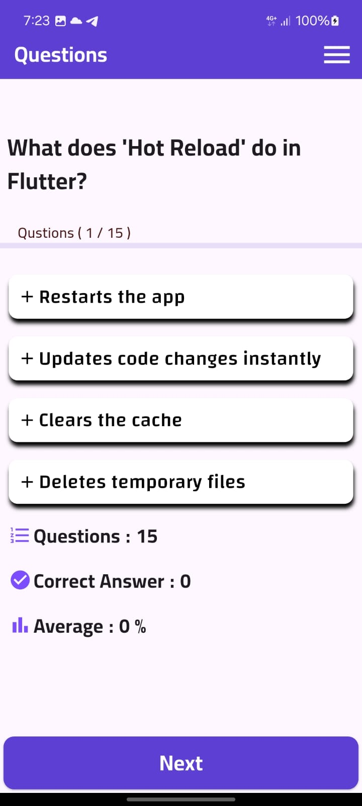
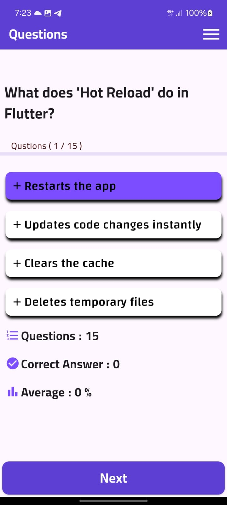
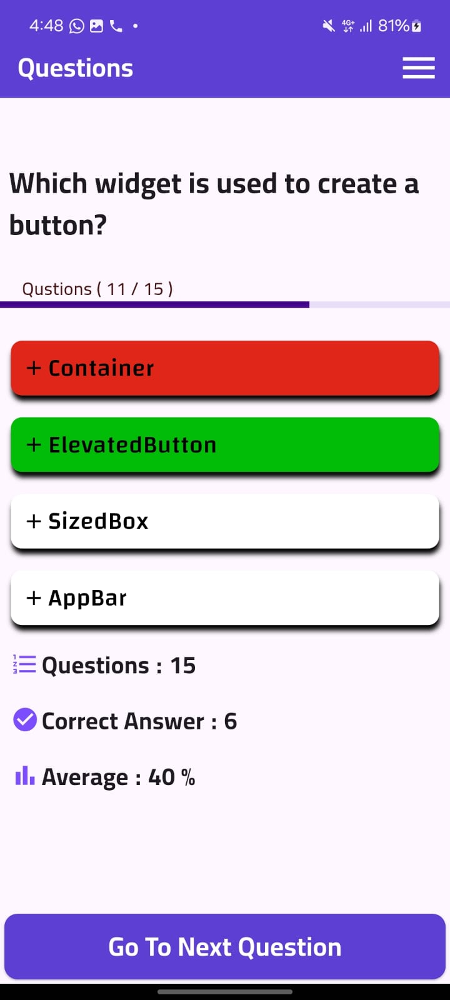

# Flutter Quiz App

A simple and interactive quiz application built using Flutter. This app allows users to answer multiple-choice questions, visually track their progress, and view their final performance in real-time.

---

## 🎯 Project Idea

The main goal of this project is to deliver a fun and educational quiz experience. The app presents one question at a time with 4 possible answers. It visually responds to the user's answer by changing button colors based on correctness, and it also tracks the number of correct answers and the final average score.

---

## 📸 Screenshots

---

## ⚙️ Key Features

- ✅ Displays a question with multiple choices.
- ✅ Highlights the selected answer with a **green** color if correct, and **red** if incorrect.
- ✅ Automatically shows the correct answer if the user selects the wrong one.
- ✅ Tracks:
  - Total number of questions
  - Number of correct answers
  - Average score as a percentage
- ✅ Progress bar to indicate quiz completion.
- ✅ Clean and modern Arabic UI using Google Fonts.

---

## 🧠 Technologies Used

- **Flutter** (Dart)
- **Google Fonts** package
- Custom UI widgets for better code structure

---
